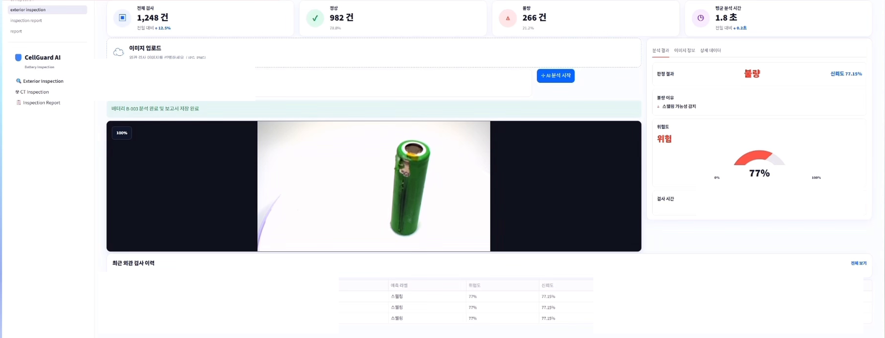
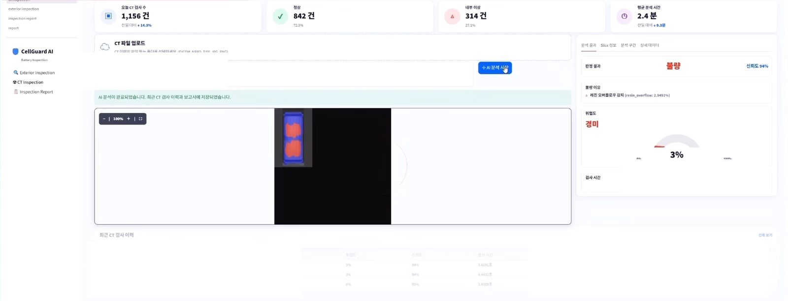
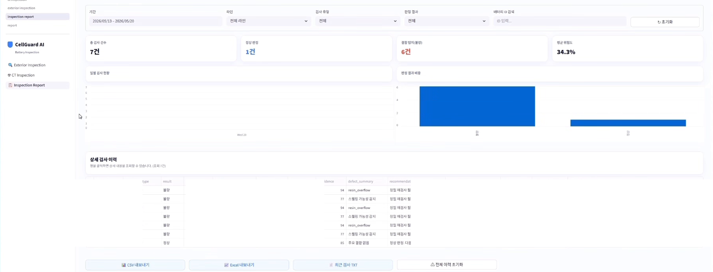

# CellGuard AI — Computer Vision 검사 서비스 연동

**역할:** Team Lead / AI Service Integration / Computer Vision Application · **기간:** 2026.05 (세부 작업은 2026.05.19–2026.05.20 Commit 기준) · **Team Project**

> 이 Case Study는 팀 프로젝트 전체가 아닌, `siaSim`이 작성한 Commit과 실제 공개 코드에서 확인되는 구현 기여를 중심으로 작성했습니다. Team Lead 및 프로젝트 담당 영역은 최종 발표자료의 보조 근거로 구분해 기록합니다.

## 프로젝트 개요 (Overview)

CellGuard AI는 이차전지 외관 이미지와 CT 이미지를 검사하고, 판정 결과를 검사 이력·리포트 화면으로 연결하는 품질검사 지원 프로젝트입니다. 저는 Computer Vision 모델 자체의 학습 성과를 주장하기보다, 외부 추론 서비스와 CT inference 결과를 검사 애플리케이션·저장·리포트·배포 흐름에 연결하는 작업을 담당했습니다.

*CellGuard 외관검사 UI — 팀 프로젝트 화면. 제 검증 가능한 기여에는 Azure Custom Vision 연동, 검사 결과 연결, Streamlit 서비스 통합이 포함됩니다.*

## 문제와 목표 (Problem & Goal)

검사 모델의 결과가 이미지 분석 단계에만 머물면 검수자가 판정 결과를 확인하거나 이전 검사와 비교하기 어렵습니다. 외관검사와 CT 검사는 서로 다른 추론 경계를 사용하지만, 사용자에게는 하나의 검사 서비스로 제공되어야 했습니다.

목표는 다음과 같았습니다.

- 외관 이미지 입력을 Azure Custom Vision 추론 결과와 연결
- CT 이미지 입력을 DeepLab 기반 inference 결과와 판정 로직에 연결
- 정상/불량, 결함 유형, 위험도, 신뢰도, 검사 시각과 시각화 결과를 저장
- 검사 이력과 상세 리포트를 조회·필터·다운로드할 수 있는 UI 제공
- Azure App Service 배포 흐름을 GitHub Actions workflow로 관리

이 문서에서는 모델을 직접 학습했다는 주장, 정확도·mIoU·F1 수치, 팀 전체 설계·리딩 성과를 포함하지 않습니다.

## 시스템 구조 (Architecture)

현재 공개 Repository의 코드에서 확인되는 논리 구조는 다음과 같습니다.

- **외관검사:** `pages/exterior_inspection.py`가 업로드 이미지를 받고 `services/custom_vision_out.py`의 Custom Vision 호출·결과 정규화·저장 흐름을 사용합니다.
- **CT 검사:** `pages/ct_inspection.py`가 `ai_models/deeplab_mobilenet/predict.py`의 `predict_one_image`를 호출하고, mask·overlay·판정 결과를 검사 기록으로 연결합니다.
- **공통 저장:** `utils/report_storage.py`가 검사 결과와 이미지/overlay 경로를 `reports.csv`에 저장·조회합니다.
- **리포트:** `pages/inspection_report.py`가 기간·라인·검사 유형·판정 결과·배터리 ID로 이력을 필터링하고, 선택한 행을 `pages/report.py`의 상세 화면으로 연결합니다.
- **배포:** `.github/workflows/main_battery-main.yml`이 Python 환경 구성, 의존성 설치, artifact 생성과 Azure Web App 배포 단계를 정의합니다.

이는 최종 운영 Architecture를 확정한 설명이 아니라, 현재 공개 코드와 Commit에서 검증 가능한 Application Integration 경계의 요약입니다.

> **Architecture placeholder**
>
> 최종 Architecture 자료가 제공된 후 별도 diagram을 추가할 예정입니다.

## 핵심 기여 (My Contribution)

### 1. 검사 AI 연동 (Inspection AI Integration)

외관검사에서는 업로드 바이트를 Azure Custom Vision endpoint에 전달하고, 응답의 prediction을 화면·저장 모델이 사용할 수 있도록 연결했습니다. 이후 환경 변수 기반 설정 조회와 2-stage Custom Vision 흐름을 추가해 Swelling 판별 후 일반 결함 분류로 이어지는 호출 경계를 구현했습니다. 이는 Custom Vision 서비스 연동과 애플리케이션 분기 구현에 대한 근거이며, 모델을 제가 학습했다는 의미는 아닙니다. [Commit c17ddad](https://github.com/ms-ai-school-10th-team3/battery/commit/c17ddad9dde8a040d7dde6172e2262bacf06580f) · [Commit 31653f8](https://github.com/ms-ai-school-10th-team3/battery/commit/31653f8cac6b55704f4e54951546fb402b063cf6) · [Commit 05fb808](https://github.com/ms-ai-school-10th-team3/battery/commit/05fb8083d366d7ec14b968968fb115c86429d6a5)

CT 검사에서는 DeepLab MobileNet 구조와 `predict_one_image` inference 흐름을 애플리케이션에서 사용할 수 있도록 연결했습니다. 전처리·추론·mask/overlay 생성·결함 pixel ratio 기반 판정이 결과 객체로 이어지며, 이 코드는 inference integration 근거로만 사용합니다. 학습 데이터 구성, 모델 훈련 주도, 성능 수치는 주장하지 않습니다. [Commit af8fcf8](https://github.com/ms-ai-school-10th-team3/battery/commit/af8fcf851e7517a2af1b005fe4a4c0e0df4572c6) · [Commit a558218](https://github.com/ms-ai-school-10th-team3/battery/commit/a55821837a2a8a1c7f78f06ea9ba624ea56903f6)

### 2. 검사 결과 저장 및 리포트 UI (Result Storage & Report UI)

외관·CT 검사 결과를 같은 저장 계약으로 모으기 위해 `save_inspection_report`에 판정, 위험도, 신뢰도, 결함 요약, 권장 조치, 모델 식별자, 원본 이미지·overlay 경로를 전달하도록 연결했습니다. `report_storage.py`에서는 보고서 목록·개별 조회·날짜/숫자 정규화와 저장 경로를 담당하도록 분리했습니다. [Commit 85f52ec](https://github.com/ms-ai-school-10th-team3/battery/commit/85f52ecf38969aef9c1c30a47bce6afd6942b0fb) · [Commit 649c9b3](https://github.com/ms-ai-school-10th-team3/battery/commit/649c9b36d8f65e97eda1de301f33cdfc4813dbba) · [Commit 1ef4a9a](https://github.com/ms-ai-school-10th-team3/battery/commit/1ef4a9aac38b9ebf46bf56beb1ad5f118c9d5505)

리포트 화면에서는 CSV 데이터를 읽어 기간·라인·검사 유형·판정 결과·Battery ID로 필터링하고, CSV/Excel/TXT 다운로드와 상세 페이지 이동을 제공합니다. 선택한 이력의 원본 이미지 또는 CT overlay를 상세 화면에 표시하도록 연결했습니다. [Commit e64b792](https://github.com/ms-ai-school-10th-team3/battery/commit/e64b7921bf94ae1c0c218a165374ba7f96466558) · [Commit 7eeef65](https://github.com/ms-ai-school-10th-team3/battery/commit/7eeef6592b6d5aeb0a520df5fc989bf90db7f362) · [Commit ff12528](https://github.com/ms-ai-school-10th-team3/battery/commit/ff12528fcd05579c60261e55a222bbe3e9565e27)

### 3. 배포 워크플로우 (Deployment Workflow)

Azure App Service 배포를 위해 GitHub Actions workflow에 Python 환경 구성, 의존성 설치, artifact 업로드, Azure 로그인, Web App deploy 단계를 추가했습니다. 최종 발표자료에는 Azure-Streamlit end-to-end 연동 성공 기록과 당시 시연 화면이 남아 있어, GitHub workflow와 함께 Azure App Service 기반 Streamlit 프로토타입 배포·시연 수준을 확인할 수 있습니다. 이는 production 운영, 실제 사용자 트래픽, SLA, 장기 가동률을 의미하지 않습니다. [Commit 80dc8e9](https://github.com/ms-ai-school-10th-team3/battery/commit/80dc8e98146e6fa03c69b4c350f06e59271c0ecf) · [Commit ec75de7](https://github.com/ms-ai-school-10th-team3/battery/commit/ec75de701bb670b82efad2864f5b1633f038164b)

## 기술적 의사결정 (Technical Decisions)

- **추론 경계 분리:** 외관은 Azure Custom Vision API, CT는 로컬 inference pipeline으로 분리해 각 결과 계약을 명확히 했습니다.
- **모델 선택과 서비스 연동:** 프로젝트의 Classification baseline 및 Detection/Segmentation 후보를 비교한 뒤, 최종 MVP에서는 서비스 연동 가능성·결과 해석·일정과 검사 영역별 역할 분리를 고려해 외관은 Custom Vision Object Detection, CT는 MobileNet + DeepLab 경계로 구성했습니다. 상세 성능 수치는 개인 성과로 사용하지 않습니다.
- **설정과 코드 분리:** Custom Vision endpoint와 key는 코드에 고정하지 않고 환경 변수 또는 Streamlit secret에서 읽도록 구성했습니다.
- **결과 중심 저장:** 모델 내부 출력 전체를 그대로 노출하기보다 화면·리포트에 필요한 판정, 위험도, 신뢰도, 결함 요약, 시각화 경로를 공통 저장 필드로 정리했습니다.
- **Azure 파일시스템 고려:** 보고서 저장 경로를 별도 storage helper로 분리하고 Azure App Service의 `/home` 기반 저장 경계를 고려했습니다.
- **보수적 성과 표현:** Commit에서 확인되는 연동·저장·UI·workflow만 기술하고 모델 성능 수치나 학습 성과는 포함하지 않았습니다.

## 서비스 동작 흐름 (Service Flow)

아래 화면은 팀 UI에서 Computer Vision 결과가 사용자에게 나타나는 형태를 보여줍니다. Frontend 전체 구현을 개인 기여로 주장하지 않습니다.

*CellGuard CT 검사 UI — 팀 프로젝트 화면. DeepLab 기반 inference 결과가 검사 판정·시각화·저장 흐름으로 연결되는 모습을 보여주며, Frontend 전체 구현을 의미하지 않습니다.*

*Inspection Report UI — 팀 프로젝트 화면. 제 검증 가능한 기여에는 검사 결과 저장, 이력 필터링, 상세 리포트 흐름이 포함됩니다.*

> 화면의 건수·confidence·risk 값은 당시 데모 UI에 표시된 값이며, 모델 성능이나 운영 지표로 해석하지 않습니다.

## 검증 결과 (Result & Validation)

현재 공개 Commit과 코드에서 확인되는 검증 범위는 다음과 같습니다.

- Custom Vision 호출은 비정상 HTTP status와 빈 응답을 예외로 처리하고, 필요한 설정이 없으면 명시적인 오류를 반환합니다.
- CT inference는 모델 weight 누락을 확인하고, `state_dict`를 로드한 뒤 `eval` 모드에서 예측·mask·overlay·JSON 결과를 생성합니다.
- 외관·CT 결과는 공통 `reports.csv` 저장 계약에 연결되며, 리포트 화면에서 필터·상세 조회·다운로드 흐름으로 이어집니다.
- Azure App Service workflow에는 build와 deploy job, Python 의존성 설치, artifact 전달 단계가 기록되어 있습니다. 발표자료의 Azure-Streamlit end-to-end 연동 기록과 시연 화면을 보조 근거로 함께 확인할 수 있지만, production 운영이나 장기 안정성은 주장하지 않습니다.

이는 코드 경로·Commit과 보조 발표자료에서 확인되는 범위입니다. Accuracy, mIoU, F1, latency, 사용자 수, production 운영·SLA·가동률은 주장하지 않습니다.

## 기여 근거 (Evidence)

대표 근거는 다음 Commit에 연결했습니다. 전체 기능별 근거와 개인/팀 경계는 [CellGuard AI Evidence](../evidence/cellguard-ai.md)에서 확인할 수 있습니다.

- [Commit c17ddad — Azure Custom Vision 연동](https://github.com/ms-ai-school-10th-team3/battery/commit/c17ddad9dde8a040d7dde6172e2262bacf06580f)
- [Commit 05fb808 — 2-stage Custom Vision 흐름](https://github.com/ms-ai-school-10th-team3/battery/commit/05fb8083d366d7ec14b968968fb115c86429d6a5)
- [Commit af8fcf8 — DeepLab inference 구조 추가](https://github.com/ms-ai-school-10th-team3/battery/commit/af8fcf851e7517a2af1b005fe4a4c0e0df4572c6)
- [Commit a558218 — CT 결과 저장 및 DeepLab 연결](https://github.com/ms-ai-school-10th-team3/battery/commit/a55821837a2a8a1c7f78f06ea9ba624ea56903f6)
- [Commit e64b792 / 7eeef65 — 리포트 및 이력 UI](https://github.com/ms-ai-school-10th-team3/battery/commit/e64b7921bf94ae1c0c218a165374ba7f96466558) · [7eeef65](https://github.com/ms-ai-school-10th-team3/battery/commit/7eeef6592b6d5aeb0a520df5fc989bf90db7f362)
- [Commit 80dc8e9 / ec75de7 — Azure App Service workflow](https://github.com/ms-ai-school-10th-team3/battery/commit/80dc8e98146e6fa03c69b4c350f06e59271c0ecf) · [ec75de7](https://github.com/ms-ai-school-10th-team3/battery/commit/ec75de701bb670b82efad2864f5b1633f038164b)

## 배운 점 (Lessons Learned)

- Computer Vision 모델의 결과가 실제 서비스 가치로 이어지려면 추론 결과를 저장·조회·시각화하는 계약이 함께 설계되어야 합니다.
- 서로 다른 모델과 외부 API를 하나의 검사 서비스에 연결할 때는 입력·판정·시각화·저장 경계를 분리해야 변경 범위를 관리하기 쉽습니다.
- 모델 성능을 주장하려면 별도의 평가셋과 재현 가능한 측정 기록이 필요하며, Application Integration Commit만으로 이를 대신할 수 없습니다.
