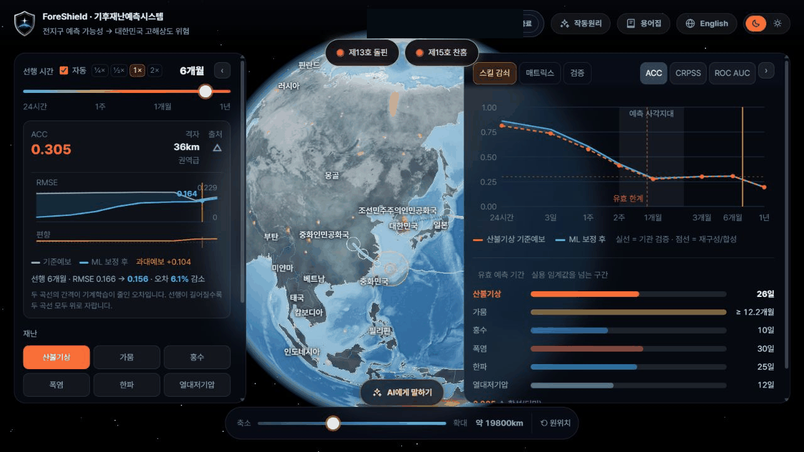
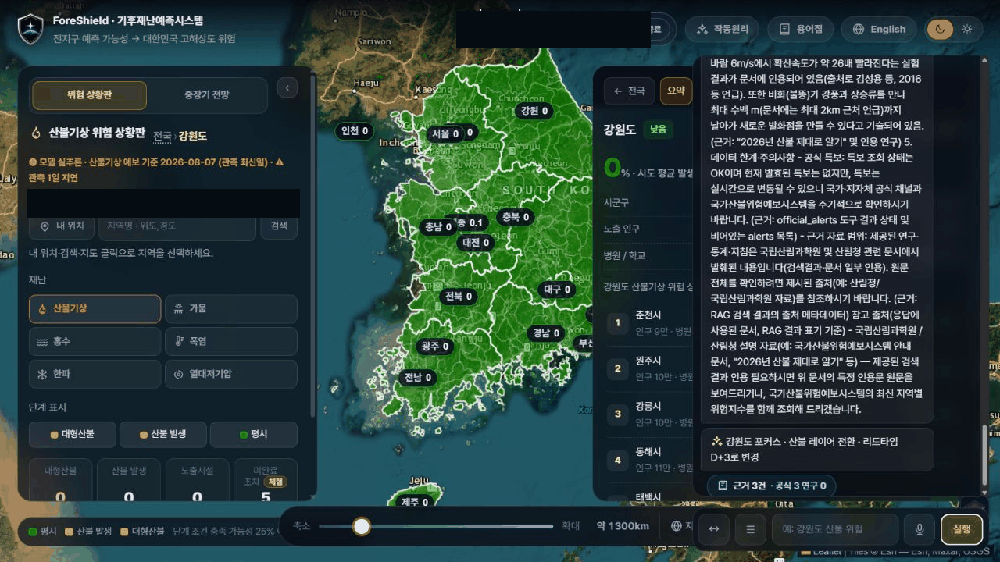
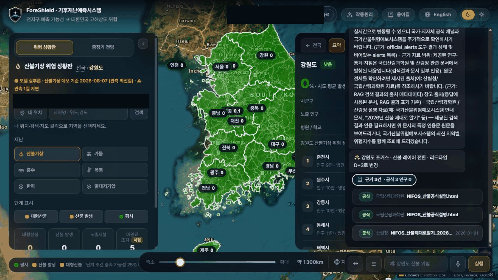
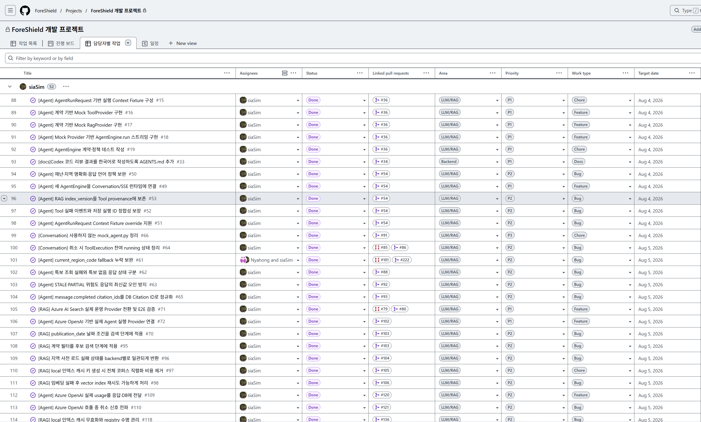

# ForeShield — 기후재난 인텔리전스

**역할:** LLM Agent / RAG / Backend · **기간:** 2026.07 – 진행 중 · **Team Project**

> 이 Case Study는 팀 프로젝트 전체가 아닌, PR·Commit·Issue 등으로 확인 가능한 개인 기여를 중심으로 작성했습니다.
>
> ForeShield 원본 소스는 private이며, 이 문서는 일반화한 설명과 확인 가능한 GitHub 기록만 사용합니다.

## 프로젝트 개요 (Overview)

ForeShield는 기후재난 질문에 지역·재난 유형·시간 범위와 공식 문서 근거를 연결해 답변하는 AI Backend 프로젝트입니다. 저는 LLM Agent 실행 기반, Context Interpretation, RAG/Provider 연결, Azure OpenAI 응답 계약, 결과 provenance와 안전 정책을 담당했습니다.

*서비스 UI — 팀 구현. 이 Case Study는 해당 흐름을 뒷받침하는 확인 가능한 AI/Backend 기여에 초점을 둡니다. 이 화면은 서비스 경험을 구성하는 예보 상태, 지도 Context, lead time, 모델 평가 패널을 보여줍니다.*

## 문제와 목표 (Problem & Goal)

자연어 재난 질문은 필요한 지역·재난·시간 정보가 누락되거나 모호할 수 있습니다. 이 상태에서 Agent가 임의의 값을 선택하거나 잘못된 Tool을 실행할 가능성을 줄이려면, Model 호출보다 먼저 입력과 실행 계약을 검증해야 했습니다.

초기 개발에서는 실제 Azure·PostgreSQL·외부 API와 분리된 반복 검증 기반이 필요했고, Provider 오류·근거 부족·부분 결과도 성공 응답과 구분해야 했습니다. 목표는 다음이었습니다.

- 외부 의존성 없이 Agent 실행 계약을 검증할 수 있는 기반 구성
- 자연어 Context를 검증 가능한 AgentPlan과 Tool 정책으로 변환
- Azure OpenAI·RAG 결과를 Structured Output, 상태, 출처, 버전과 함께 연결
- 모호한 입력, Prompt Injection, 허용되지 않은 실행을 fail-closed로 처리

## 시스템 구조 (Architecture)

최종 서비스 Architecture는 아직 확정되지 않았습니다. 현재 코드와 PR에서 확인되는 논리적 구성은 다음과 같습니다.

- **Contract layer:** AgentRunRequest, AgentPlan, Agent Event가 입력·계획·실행 결과의 경계를 정의합니다.
- **Decision layer:** Context Interpretation과 Intent-based Tool Router가 필수 입력, clarification, Tool 정책을 결정합니다.
- **Provider layer:** Tool/RAG Provider와 Azure OpenAI Provider가 계약에 맞는 결과와 Structured Answer를 제공합니다.
- **Result layer:** Orchestration과 ToolResultLedger가 상태·provenance·version을 보존해 최종 응답으로 전달합니다.

아래 구성은 현재 검증 가능한 Backend 경계를 요약한 것입니다.

> **Architecture placeholder**
>
> 프로젝트 Architecture가 확정된 후 Architecture diagram을 추가할 예정입니다.

## 핵심 기여 (My Contribution)

### 1. Agent 기반 및 Context Interpretation (Agent Foundation & Context Interpretation)

Provider 구현 전에 실행 순서와 상태를 검증할 수 있도록 AgentRunRequest Fixture, Mock ToolProvider, Mock RagProvider, MockAgentEngine과 계약·정책 테스트를 구현했습니다. Issue #15–#19를 Context Fixture → Mock Tool → Mock RAG → AgentEngine → Test 순서로 나누어 PR #36에 연결했습니다.

그 위에 자연어 요청을 바로 Tool 호출로 넘기지 않고 Context Interpretation을 AgentPlan으로 변환하도록 구현했습니다. 지역·재난·lead 등 필수 정보가 불명확하면 임의 fallback 대신 clarification 또는 오류 상태로 종료하도록 했습니다. PR #36 (Private) · PR #187 (Private) · PR #194 (Private)

### 2. Intent-based Tool Routing 및 실행 정책 (Intent-based Tool Routing & Execution Policy)

불완전한 요청이 잘못된 Tool 실행으로 이어질 가능성을 줄이기 위해 intent별 Tool 선택, 필수 입력 확인, clarification과 병렬화 후보를 분리한 Router 정책을 구현했습니다.

또한 Live/Training 모드별 allowlist, 승인 전 deferred 상태, UI Action의 실행 대상 검증을 Backend 정책으로 두었습니다. 따라서 사용자의 확인이 필요한 동작이나 실제 화면 상태와 맞지 않는 동작은 실행하지 않고 종료할 수 있습니다. PR #221 (Private) · PR #224 (Private) · PR #252 (Private)

### 3. Azure OpenAI / RAG 연동 및 Structured Output (Azure OpenAI / RAG Integration & Structured Output)

기존 Agent 계약을 Azure OpenAI Response Provider와 실제 RAG Provider에 연결하고, 로컬 Mock 경로와 Azure Search 경계를 설정으로 분리했습니다. Azure 최종 응답에는 strict JSON Schema와 검증 가능한 fallback을 적용해 자유 형식 응답을 그대로 성공 처리하지 않도록 했습니다. PR #80 (Private) · PR #102 (Private) · PR #234 (Private)

### 4. Orchestration, Provenance 및 Safety (Orchestration, Provenance & Safety)

여러 Tool/RAG 결과를 합칠 때 상태와 근거가 사라지지 않도록 ToolResultLedger와 결과 Metadata 전달을 구현했습니다. source type, data/model/index version, reference time과 ERROR·NO_DATA·PARTIAL·STALE 상태를 결과 Event와 응답에 보존했습니다.

RAG와 Context 안의 문장은 시스템 지시가 아닌 데이터로 처리하도록 Prompt 경계를 보강했고, Structured Output 위반·허용되지 않은 Action·실행 대상 불일치는 fail-closed로 처리했습니다. Token diagnostics에는 원문 대신 finish reason, response length, 제한된 usage 정보만 남기도록 했습니다. PR #230 (Private) · PR #241 (Private) · PR #245 (Private)

실제 HTTP/SSE 경로의 ConversationContext 주입은 팀원 Nyahong의 PR #218에서 구현되었습니다. 이 Case Study는 해당 기능을 제 단독 구현으로 표현하지 않고, 제가 담당한 Agent 계약·해석·검증 계층과의 연결 지점만 다룹니다.

## 기술적 의사결정 (Technical Decisions)

- **외부 의존성 격리:** Azure와 DB를 먼저 연결하기보다 Contract-based Mock Provider로 실행 순서와 상태를 반복 검증했습니다.
- **명시적 불확실성:** 모호한 Context에 임의 fallback을 적용하지 않고 clarification 또는 fail-closed를 선택했습니다.
- **결과 보존:** 검색 실패를 단순 NO_DATA로 축약하지 않고 상태·출처·버전을 함께 전달했습니다.
- **응답 통제:** JSON Schema, allowlist, Prompt 경계를 조합해 Model 출력과 Tool 실행을 각각 검증했습니다.

## 서비스 동작 흐름 (Service Flow)

최종 Architecture는 아직 확정되지 않았습니다. 아래 화면은 Agent/RAG/Backend 기능이 팀 UI에서 제공되는 방식을 보여주는 용도입니다.

*서비스 UI — 팀 구현. 이 Case Study는 해당 흐름을 뒷받침하는 확인 가능한 AI/Backend 기여에 초점을 둡니다. 이 응답 흐름은 본문에서 설명한 Context Interpretation, Tool Routing, RAG retrieval, Structured Output 검증을 기반으로 합니다.*

*서비스 UI — 팀 구현. 이 Case Study는 해당 흐름을 뒷받침하는 확인 가능한 AI/Backend 기여에 초점을 둡니다. 이 근거 화면은 Structured Response를 RAG retrieval 및 공개적으로 확인 가능한 문서명과 연결해 보여주며, Frontend 구현 소유권을 의미하지 않습니다.*

## 개발 워크플로우 (Engineering Workflow)

Agent 실행 기반을 한 번에 구현하지 않고 GitHub Issue와 Project로 검증 단위를 나누어 추적했습니다.

ForeShield Project #1 (source items private)에서 다음 작업이 siaSim 담당, LLM/RAG 영역, P1, Feature 또는 Chore, Done 상태로 표시되고 PR #36 (Private)과 연결되어 있습니다.

*GitHub Projects — ForeShield LLM/RAG work items. Agent/RAG 작업을 Issue 단위로 분해하고 Assignee·Priority·Status·Linked PR을 연결해 관리한 팀 개발 보드입니다. 화면은 siaSim 담당 작업을 중심으로 보여주며, Project Item 생성자를 개인 기여로 주장하지 않습니다.*

1. Issue #15 (Private): AgentRunRequest Context Fixture
2. Issue #16 (Private): 계약 기반 Mock ToolProvider
3. Issue #17 (Private): 계약 기반 Mock RagProvider
4. Issue #18 (Private): Mock Provider 기반 AgentEngine streaming
5. Issue #19 (Private): AgentEngine 계약·정책 테스트

즉, Context → Provider → Engine → Test 순서로 기능을 분해하고 담당자·우선순위·상태·PR 연결을 개발 흐름에 묶은 경험입니다. Project 화면은 Item 생성자를 별도로 노출하지 않으므로, Issue 작성자와 Project Item 생성자를 동일하다고 주장하지 않습니다.

## 신뢰성 및 안전 설계 (Reliability & Safety)

- 필수 Context가 없거나 모호하면 임의 값을 선택하지 않고 clarification 또는 오류로 종료
- Structured Output 위반과 Provider의 ERROR·NO_DATA·PARTIAL·STALE 상태를 성공으로 변환하지 않음
- RAG/Context 안의 Embedded Prompt Instruction을 데이터로만 취급
- Live/Training allowlist, UI Action target 검증, 승인 전 deferred 정책으로 외부 영향 차단
- Token diagnostics에 사용자 입력·모델 출력 원문을 기록하지 않음

## 검증 결과 (Result & Validation)

대표 검증 결과만 남깁니다. 수치는 각 PR에 기록된 결과이며 이 문서 작성 과정에서 Private Repository 전체를 재실행한 결과가 아닙니다.

- PR #36 (Private): 로컬 pytest 34 passed, 17 skipped, Ruff와 GitHub Actions 단계 통과
- PR #221 (Private): Intent-based Tool Router 집중 테스트 21 passed
- PR #234 (Private): Agent Provider·Context Interpretation·Azure Chat 집중 테스트 32 passed
- PR #245 (Private): Agent/SSE 관련 테스트 34 passed; 전체 실행의 환경 의존 실패는 별도 구분

운영 검증 범위는 코드·집중 테스트와 분리합니다. 실제 Azure·PostgreSQL·Azure Search 운영 E2E와 Production 상태는 별도 배포 환경에서 확인해야 합니다. 이 기록만으로 성능, 사용자 수, 정확도, Latency 개선 수치는 주장하지 않습니다.

## 기여 근거 (Evidence)

핵심 근거는 다음 PR에 연결했습니다.

- PR #36 (Private) — Contract-based Agent Engine foundation
- PR #194 (Private) — Context Interpretation
- PR #221 (Private) — Intent-based Tool Router
- PR #230 (Private) — Prompt Injection defense
- PR #234 (Private) — Structured Answer
- PR #245 (Private) — Orchestration and provenance

전체 PR·Issue·Commit과 핵심 파일 경로는 [ForeShield Evidence](../evidence/foreshield.md)에 정리했습니다. Private Repository의 링크는 외부 채용 담당자에게 보이지 않을 수 있습니다.

## 배운 점 (Lessons Learned)

- Agent 기능은 Model 호출보다 입력·Tool·결과·오류 계약을 먼저 고정해야 반복 검증이 가능합니다.
- Context 해석, ConversationContext 연결, Tool 실행 정책은 서로 다른 경계이므로 분리해서 검증해야 합니다.
- RAG 답변의 신뢰성은 내용뿐 아니라 상태·출처·버전·기준 시점을 함께 보존할 때 유지됩니다.
