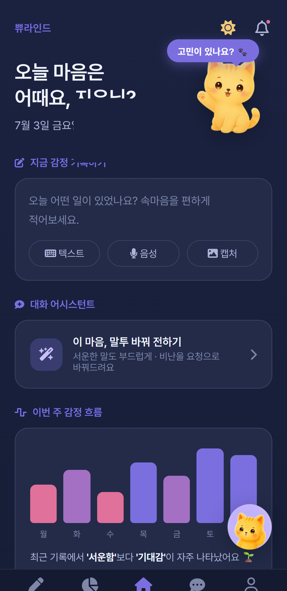
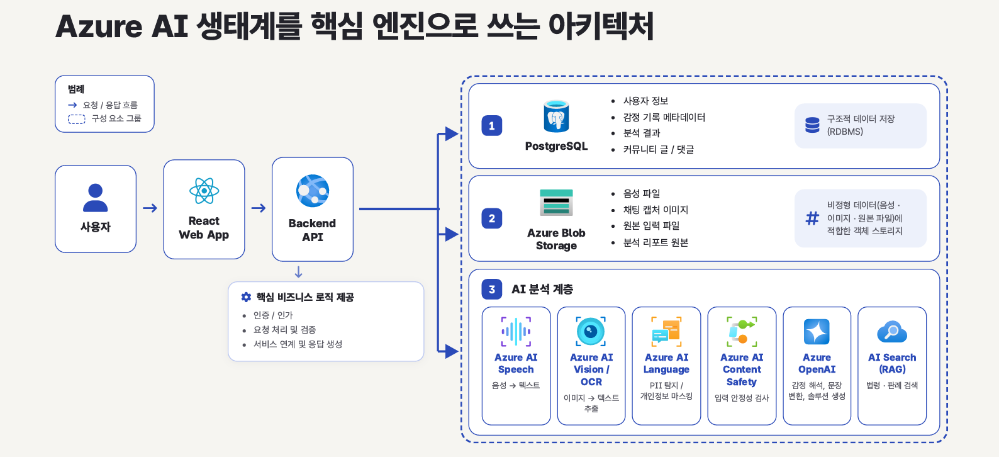
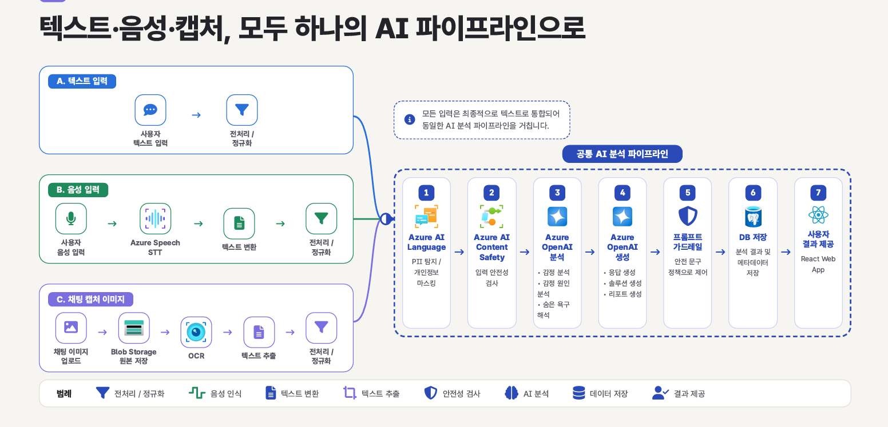
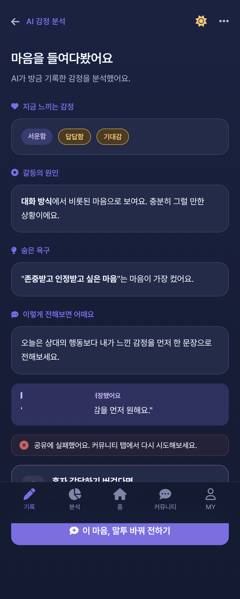
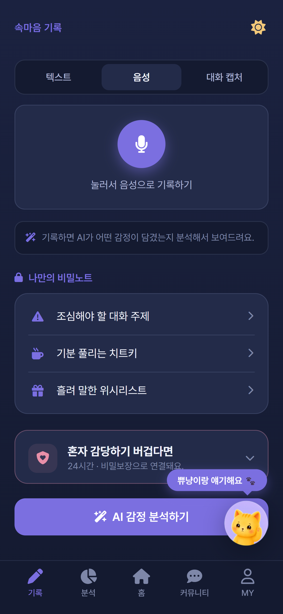
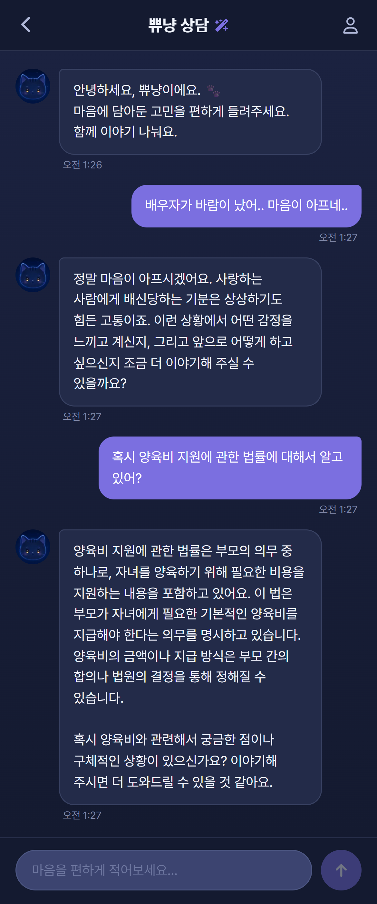

# PPYURIND — 감정·갈등 기록 분석

**역할:** AI Backend / LLM Application · **기간:** 2026.06.29–2026.07.05 (siaSim PR 기록 기준) · **Team Project**

> 이 Case Study는 팀 프로젝트 전체가 아닌, PR·Commit·Issue 등으로 확인 가능한 개인 기여를 중심으로 작성했습니다.
>
> PPYURIND 원본 소스는 private이며, 이 문서는 일반화한 설명과 확인 가능한 GitHub 기록 링크만 사용합니다.

## 프로젝트 개요 (Overview)

PPYURIND는 감정·갈등 기록을 분석하고, 대화 표현을 바꾸며, 일반 상담·법률 정보·안전 안내를 구분하는 AI Backend 프로젝트입니다. 저는 Azure OpenAI 응답 계약 확장, 개인정보 보호, Safety Policy, RAG routing과 법률 정보 범위, 라벨·저장 신뢰성 개선을 담당했습니다.

*서비스 UI — 팀 구현. 이 화면은 Backend/AI 결과와 text / voice / capture 입력 진입점이 팀 UI에서 제공되는 형태를 보여줍니다. 이 Case Study는 해당 흐름을 뒷받침하는 확인 가능한 AI/Backend 기여에 초점을 둡니다.*

## 문제와 목표 (Problem & Goal)

감정 기록 서비스의 입력은 개인식별정보와 민감한 관계 맥락을 포함할 수 있고, 하나의 채팅 흐름 안에서도 일반 관계 고민·법률 정보·즉시 안전 위험이 섞일 수 있습니다. 자유 형식 LLM 응답만으로 처리하면 개인정보가 분석·저장 경계를 넘거나, 법률 판단과 안전 안내가 잘못된 순서로 제공될 위험이 있었습니다.

목표와 제약은 다음과 같았습니다.

- Azure OpenAI 응답을 기존 API와 호환되는 Structured Output으로 연결
- 분석·저장·공유 전에 PII를 보호하고, PII masking·LLM 분석·Tone Conversion의 fallback 경계를 명시
- STT/OCR은 Azure 장애 시 대체 인식기로 전환하지 않고 오류를 반환하는 별도 실패 경계를 유지
- 법률 RAG는 법률성 맥락에만 연결하고, 근거가 약한 주제는 상담 준비 수준으로 제한
- 긴급 상황은 법률 설명보다 안전 안내가 우선되도록 정책화
- 기존 프론트·DB 계약을 깨지 않으면서 라벨, 저장, 테스트 정합성 개선

## 시스템 구조 (Architecture)

아래 다이어그램은 PPYURIND 팀 프로젝트의 전체 시스템 구성을 보여주는 **Team-level System Architecture**입니다.

*Team-level architecture — React Web App, Backend API, PostgreSQL, Blob Storage와 Azure AI 서비스 간의 전체 연결 관계를 보여주는 팀 설계 자료입니다. 다이어그램 전체를 개인 구현 범위로 주장하지 않습니다.*

현재 코드와 PR에서 확인되는 Backend 논리 구조는 다음과 같습니다.

- **Input protection:** 기록·분석·미디어·커뮤니티 입력을 공통 PII masking 경로로 통과시킵니다.
- **Analysis layer:** Emotion Analysis와 Tone Conversion이 Azure OpenAI Structured Output 또는 명시된 backend fallback을 사용합니다.
- **Policy layer:** Content Safety 결과와 AI Safety Policy가 위험도·긴급 정책·법률 표현 제한을 결정합니다.
- **Routing layer:** 일반 상담, 법률 RAG, 안전 안내를 현재 질문과 대화 이력에 따라 분리합니다.
- **Persistence layer:** 분석 결과, 저장 상태, label taxonomy와 응답 필드를 기존 계약에 맞춰 정규화합니다.

이는 최종 배포 Architecture나 Frontend 전체 구현을 확정하는 설명이 아니라, 현재 개인 기여를 검증할 수 있는 Backend 경계의 요약입니다.

### AI / Input Data Flow

텍스트·음성·채팅 캡처 입력이 하나의 분석 경계로 연결되는 팀 설계 흐름입니다.

*Team-level data flow — 입력 방식별 전처리 이후 개인정보 보호, Safety, AI 분석·생성, 저장과 결과 제공으로 이어지는 전체 흐름을 보여줍니다.*

이 전체 흐름 중 제가 PR·Commit으로 확인 가능한 주요 범위는 멀티모달 Backend 입력 경계, PII masking, Structured LLM response contract, Safety Policy, Legal RAG routing, taxonomy 및 저장 신뢰성 개선입니다. Frontend 전체, DB 전체 설계, 팀 인프라 전체를 개인 기여로 주장하지 않습니다.

## 핵심 기여 (My Contribution)

### 1. 멀티모달 입력 및 Structured LLM 분석 (Multimodal Input & Structured LLM Analysis)

text / voice / image 입력을 같은 분석 경계로 연결하기 위해 인증된 Media API와 입력 타입 계약을 추가했습니다. 음성은 브라우저 realtime STT용 short-lived Azure Speech token을 발급하고, 브라우저 realtime STT와 별도로 업로드 오디오를 처리하는 STT endpoint를 두었습니다. Azure Speech 실패 시 대체 인식기로 자동 전환하지 않고 명시적인 502 오류를 반환합니다. 이미지는 Azure Vision OCR과 Blob upload를 거쳐 `masked_text`를 반환하도록 구성했습니다. PR #16 (Private) · Commit e1862bf (Private)

PR #16은 Media 결과의 `masked_text`를 반환하고, 같은 변경에서 Emotion/records analysis service가 masking된 입력을 안전성 검사·LLM 분석·저장에 사용하도록 연결했습니다. 테스트는 voice/image 입력과 masking 순서, media endpoint 인증·입력 검증을 확인합니다. 다만 STT/OCR 자체는 Azure 장애 시 다른 인식기로 fallback하지 않고 502 오류를 반환합니다.

기존 감정 분석 응답을 단순 감정 목록에서 사실·해석·느낀 감정·균형 관점과 키워드별 sentiment로 확장했습니다. Azure OpenAI `EmotionAnalysisResult` 계약에 새 구조를 추가하고, 점수 범위와 label을 정규화해 저장 응답과 API schema가 같은 기준을 사용하도록 했습니다. PR #30 (Private) · Commit 6142601 (Private)

Tone Conversion에서는 Azure 응답과 backend mock fallback을 `source`로 구분하고, 설정 누락·빈 응답·호출 예외가 명시된 fallback으로 내려가도록 응답 계약을 보강했습니다. PR #20 (Private)

초기 Azure 기반 감정 분석과 기본 Tone Conversion 구현 자체는 팀원의 PR에서 시작된 범위이며, 이 문서에서는 제가 작성한 후속 계약 확장과 fallback 정비만 개인 기여로 설명합니다.

### 2. PII 보호 및 Safety Policy (PII Protection & Safety Policy)

Azure AI Language PII Detection을 공통 masking 경로에 연결하고, Azure 설정이 없거나 실패하면 기존 정규식 fallback을 사용하도록 구성했습니다. 동기 Azure 호출을 async wrapper로 감싸 기록·감정·미디어·커뮤니티·직접 AI 분석 경로에서 동일한 정책을 적용했습니다. PR #28 (Private)

또한 기존 `normal/caution/danger` 호환성을 보존하면서 `emergency`를 optional meta/safety 정보로 전달하고, DB 저장 시에는 legacy 값으로 안전하게 정규화했습니다. 긴급 연락처와 법률·상담 표현 제한을 별도 Policy로 분리해 알 수 없는 category에도 안전 기본값을 반환하도록 했습니다. PR #26 (Private)

Content Safety의 초기 분석·저장 통합은 팀 구현이었고, 저는 이후 Chat routing에서 Content Safety 결과와 실제 위험 표현을 결합하는 안전 분기와 테스트를 보강했습니다. PR #31 (Private)

### 3. RAG Chat Routing 및 법률 정보 범위 (RAG Chat Routing & Legal Information Boundaries)

일반 관계 고민에도 법률 Search가 연결될 수 있던 경계를 현재 질문과 최근 사용자 history의 법률성 맥락을 기준으로 분리했습니다. 법률성일 때만 Azure Search data source를 사용하고, 즉시 위험이면 RAG보다 Safety Card를 우선하도록 했습니다. 부정문, 인용 문맥, 과거 피해 진술과 실제 현재 위험 표현을 구분하는 테스트도 추가했습니다. PR #31 (Private)

RAG 근거가 상대적으로 약한 불륜·도박·접근금지 같은 주제는 승소 가능성이나 신청 요건을 단정하지 않고, 날짜별 사실관계·적법한 기록 정리·전문가 상담 권장 수준으로 제한했습니다. 양육·재산·가사소송 등 주제별 guidance를 분리해 같은 포괄 문구를 반복하지 않도록 했습니다. PR #32 (Private)

### 4. Taxonomy 및 Backend 신뢰성 (Taxonomy & Backend Reliability)

감정·갈등 주제·숨은 욕구·관계 패턴·Safety·RAG 신뢰도·AI Tone 등의 라벨을 공통 taxonomy로 모으고, helper를 Schema·Prompt·Test에서 재사용할 수 있게 했습니다. 기존 `realistic` 입력을 호환하면서 canonical label은 `honest`로 정규화하고, `label_schema_version`을 optional metadata로 관리했습니다. PR #27 (Private)

분석 저장에서는 빈 입력을 거절하고, 동일 사용자·최근 시간 범위·유사도 기준으로 중복 기록을 update/create로 구분했습니다. 리포트 기간의 종료일 포함 문제와 기록 시각 갱신도 보완했습니다. PR #22 (Private) · PR #24 (Private) · PR #33 (Private)

## 기술적 의사결정 (Technical Decisions)

- **계약 우선:** LLM 출력은 Pydantic 기반 구조와 정규화 단계를 거친 뒤 API·저장 모델로 전달
- **보호 경계 우선:** 분석보다 먼저 PII masking을 적용하고, PII masking·LLM 분석·Tone Conversion은 명시된 fallback을 사용하되 STT/OCR Azure 실패는 502로 명시
- **라우팅 보수성:** 일반 상담에 법률 RAG를 자동 연결하지 않고, 법률·안전 맥락을 별도 판별
- **호환성 유지:** 기존 필수 필드와 DB 제약을 보존하면서 `meta`, `safety`, `source`, `save_action` 같은 optional/확장 필드 사용

## 서비스 동작 흐름 (Service Flow)

아래 화면은 팀 UI에서 제 Backend/AI 결과가 사용자에게 나타나는 형태를 보여주는 용도로만 사용합니다. Frontend 전체 구현을 제 기여로 주장하지 않습니다.

*서비스 UI — 팀 구현. 이 화면은 Structured LLM Analysis 결과가 감정·갈등 원인·숨은 욕구·전달 제안 형태로 표시되는 지점을 보여줍니다. 이 Case Study는 해당 흐름을 뒷받침하는 확인 가능한 AI/Backend 기여에 초점을 둡니다.*

*서비스 UI — 팀 구현. 이 화면은 text / voice / capture 입력 경계와 음성 기록 진입점을 보여주며, 실제 STT 변환 결과 화면을 의미하지 않습니다. 이 Case Study는 해당 흐름을 뒷받침하는 확인 가능한 AI/Backend 기여에 초점을 둡니다.*

*서비스 UI — 팀 구현. 일반 관계 고민에서 법률성 질문으로 전환되는 사용자 흐름을 보여줍니다. Backend에서는 현재 질문과 대화 맥락을 기준으로 일반 상담과 Legal RAG 경로를 분리하도록 구현했습니다.*

## 신뢰성 및 안전 설계 (Reliability & Safety)

- Azure PII Detection 실패·미설정 시 regex fallback으로 전환하고, 내부 오류 상세를 응답·로그에 그대로 노출하지 않음
- Content Safety와 텍스트 위험 신호를 함께 사용하되 단순 법률 키워드만으로 emergency를 판정하지 않음
- `emergency`와 legacy `danger`를 분리해 기존 API·DB 계약을 보호
- 법률 RAG는 법률성 맥락에만 연결하고, 약한 근거 주제는 결과 예측이 아닌 상담 준비로 제한
- Label과 저장 결과를 정규화해 알 수 없는 값·중복 입력·기간 경계 오류를 안전하게 처리

## 검증 결과 (Result & Validation)

### 소프트웨어 테스트 (Software Tests)

PR과 Commit에서 확인 가능한 Backend 검증 결과는 다음과 같습니다.

- PR #20 (Private): Tone Conversion의 Azure 성공·설정 누락·호출 실패 fallback 및 `source` 구분 테스트 보강
- Commit `fe02d51` (Private): Safety Policy 집중 테스트 15 passed
- Commit `22c688b` (Private): Label taxonomy 테스트 21 passed
- PR #24 (Private): Report 기간 경계 테스트 결과 69 passed가 Commit 기록에 남아 있음
- PR #33 (Private): 감정 기록 중복 저장·시각 갱신 테스트 7 passed

PR #28, #30, #31, #32에는 관련 테스트 파일과 검증 시나리오가 추가되어 있지만, 공개 PR 기록에서 일관된 전체 통과 수치가 확인되지 않는 항목은 숫자로 확대하지 않았습니다. PR #30 자체도 일부 검증 항목을 미완료로 표시하므로 완료된 LLM 평가로 표현하지 않습니다.

### LLM 품질 평가 (LLM Quality Evaluation)

LLM 응답 품질을 소프트웨어 테스트와 별도 평가셋으로 구분해 확인하기 위해 평가셋을 구성했습니다.

- **Responsible AI Hard Set:** 60건
- **General Stability Set:** 120건
- **총 평가 건수:** 180건
- **평가 실행:** Python Eval Harness가 프로젝트 API endpoint에 평가 데이터를 자동 입력하고 결과를 채점

General Stability Set에서는 120/120 요청이 HTTP 200을 반환했고, 응답 구조 안정성은 100%였습니다. Responsible AI Hard Set에서는 위험 Recall 33.3%, F1 37.5%를 측정했습니다. 낮은 위험 탐지 성능을 숨기지 않고, 해당 결과를 이후 개선 우선순위 도출에 사용했습니다.

이 수치는 프로젝트 평가 결과이며, 공개 GitHub PR·Commit 기반 소프트웨어 테스트 결과와는 별도의 Evaluation Evidence로 구분합니다. 평가 원본 스크립트와 결과 파일은 이 공개 Repository에 포함하지 않습니다.

## 기여 근거 (Evidence)

대표 근거는 아래 PR에 연결했습니다. 전체 근거 장부와 개인/팀 경계는 [PPYURIND Evidence](../evidence/ppyurind.md)에서 확인할 수 있습니다.

- PR #16 (Private) — Authenticated media OCR and realtime STT token flow
- PR #20 / #30 (Private) — Structured LLM response contracts
- PR #26 (Private) — AI Safety Policy Layer
- PR #27 (Private) — Label taxonomy
- PR #28 (Private) — Azure AI Language PII masking
- PR #30 (Private) — Structured emotion analysis extension
- PR #31 / #32 (Private) — RAG routing and legal scope

Private Repository 링크는 외부 채용 담당자에게 보이지 않을 수 있습니다. 원본 소스, PR diff, 내부 Prompt 전문, API 계약 전문, Secret, Azure Resource 정보, RAG Corpus는 이 Repository에 복사하지 않습니다.

## 배운 점 (Lessons Learned)

- LLM 기능은 모델 호출보다 응답 계약·정규화·fallback을 먼저 설계해야 기존 서비스와 안전하게 연결됩니다.
- PII, Content Safety, 법률 RAG는 하나의 “안전 기능”이 아니라 서로 다른 경계로 분리해 검증해야 합니다.
- 민감한 도메인에서는 더 구체적인 답변보다, 근거 범위와 불확실성을 보존하는 라우팅이 신뢰성에 중요합니다.
